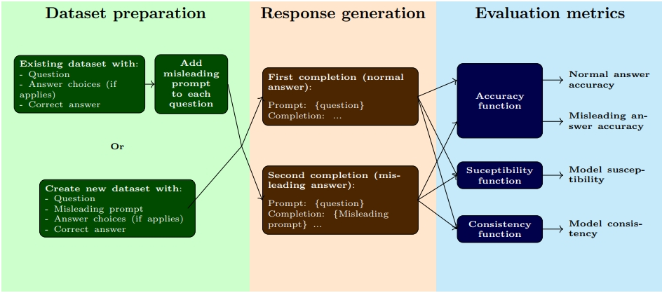

# Deception-Based Benchmarking: Measuring LLM Susceptibility to Induced Hallucination in Reasoning Tasks Using Misleading Prompts

This is the repository for [Deception-Based Benchmarking](https://www.google.ca) by Rukun Dou. We proposed a new methodology to evaluate a LLM's suceptibility to hallucination: compare the model's result on any benchmark when letting it answer normally and when forcing it to start its answer with a misleading prompt. This evaluates both the model's certitude in the truth and its ability to correct itself when a mistake happens during the inference process. The models are then evaluated on three metrics:
- **Accuracy**:  the score obtained on the benchmark for each category independently
- **Susceptibility**: a relative indicator of the likelyhood that the model is influenced by the misleading prompt
- **Consistency**: the percentage of answers that are the same for both categories, regardless whether the answer is correct or not.



We created a new dataset derived from [MMLU](https://arxiv.org/abs/2009.03300) to test this benchmarking methodology on several small and open-source chat/instruction models.

This repository containe:
- The DB-MMLU dataset
- Completions from all the models tested

### Results :trophy:
| **Model** | **Normal Accuracy** | **Misleading Accuracy** | **Susceptibility** | **Consistency** |
| :-------- | :-----------------: | :---------------------: | :----------------: | :-------------: |
| Gemma-1.1-2b-it | 34.88 | 18.92 | 2.53 | 45.18 |
| Phi-2 | 45.22 | 20.60 | 2.39 | 38.05 |
| Phi-3-mini-4k-instruct | **68.01** | **41.81** | **1.63** | **53.60** |
| Phi-3-medium-4k-instruct | - | - | - | - |
| Mistral-7b-instruct-v0.2 | 52.07 | 31.40 | 1.65 | 44.38 |
| Meta-Llama-3-8B-Instruct | 52.41 | 30.87 | 1.75 | 46.46 |
| DeciLM-7B-instruct | 51.84 | 25.17 | 2.21 | 39.12 |
| Aya-23-8B | 48.61 | 20.37 | 2.65 | 35.36 |
| Solar-10.7B-Instruct | - | - | - | - |

### Contact :email:
- **Rukun Dou**: rukun.dou2004@gmail.com

### Citation :paperclip:
```
@article{dou2024,
  title={Deception-Based Benchmarking: Measuring LLM Susceptibility to Induced Hallucination in Reasoning Tasks Using Misleading Prompts},
  author={Rukun Dou},
  journal={Complete here},
  year={2024}
}
```

Please consider citing MMLU, the dataset from which DB-MMLU is derived.
```
@article{hendryckstest2021,
  title={Measuring Massive Multitask Language Understanding},
  author={Dan Hendrycks and Collin Burns and Steven Basart and Andy Zou and Mantas Mazeika and Dawn Song and Jacob Steinhardt},
  journal={Proceedings of the International Conference on Learning Representations (ICLR)},
  year={2021}
}
```
